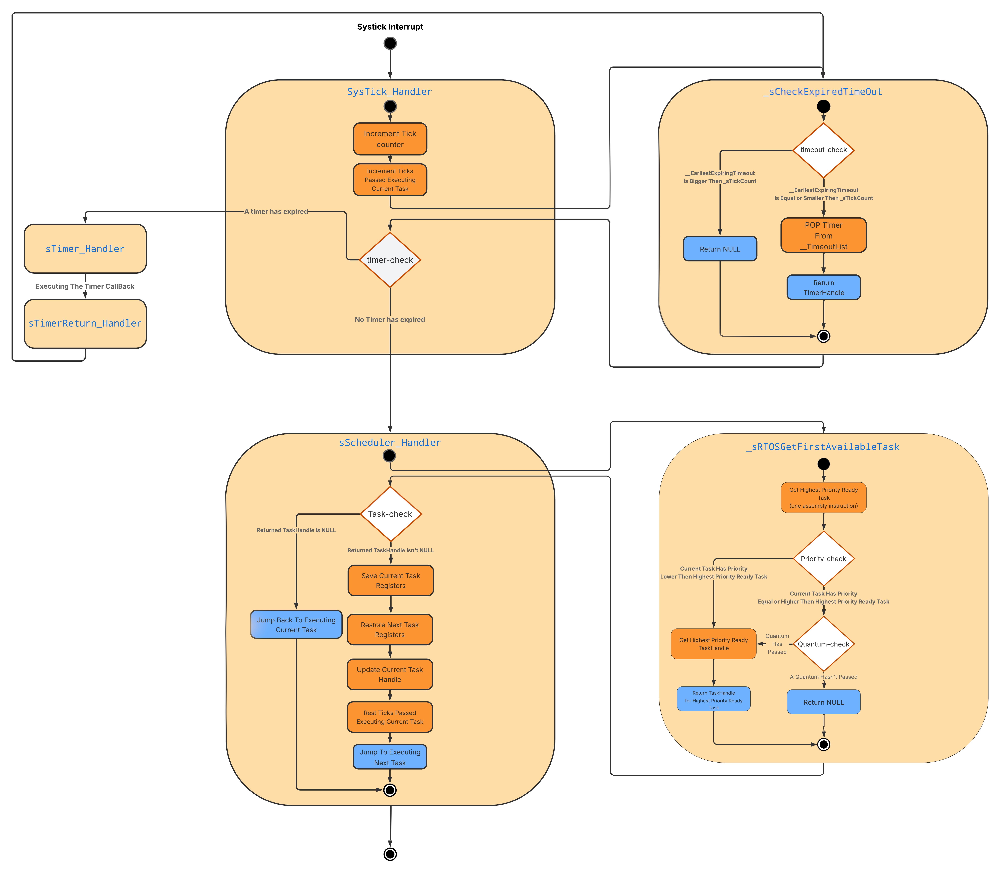

# simpleRTOS

A lightweight Real-Time Operating System (RTOS) designed for ARM Cortex-M4 microcontrollers. Features include tasks, timers, semaphores, mutexes, queues, and task notifications.

**Intended for learning and experimentation.** Supports both preemptive and non-preemptive priority-based scheduling using SysTick, with a minimal memory footprint.

> **⚠️ Note:** This is not intended for production use. Requires GCC compiler.

## Table of Contents

- [Features](#features)
- [Architecture](#architecture)
- [Getting Started](#getting-started)
  - [Prerequisites](#prerequisites)
  - [Installation](#installation)
  - [Configuration](#configuration)
- [Quick Start Example](#quick-start-example)
- [API Reference](#api-reference)

## Features

- **O(1) Scheduler:** Bitmap-based priority selection for constant-time task switching
- **32 Priority Levels:** Each priority supports multiple tasks with round-robin scheduling
- **Priority Inheritance:** Automatic priority boosting to prevent priority inversion
- **Low Memory Footprint:** Optimized for resource-constrained embedded systems
- **Comprehensive Synchronization:** Semaphores, mutexes, queues, and task notifications
- **Software Timers:** Periodic and one-shot timers

## Architecture

- **O(1) Scheduler:** Uses a bitmap to select the highest-priority runnable task in constant time
- **32 Priority Levels:** Each priority is mapped to a bit in the bitmap; tasks at the same priority are organized in a circular doubly linked list for efficient O(1) enqueue/dequeue and fair round-robin scheduling
- **Priority Inheritance:** Tasks waiting on mutexes or notifications automatically inherit the priority of blocking tasks to mitigate priority inversion

### Scheduler Overview



## Getting Started

### Prerequisites

- **Hardware:** ARM Cortex-M4 microcontroller (e.g., STM32F4 series)
- **Toolchain:** GCC ARM compiler (arm-none-eabi-gcc)
- **Build System:** Make or compatible build tool
### Installation

1. **Clone or download** this repository into your project directory
2. **Add source files** to your build:
   - All source files from the `src/` directory
3. **Include headers** in your project:
   - Add `inc/` directory to your include path
4. **Include the main header** in your application:
   ```c
   #include "simpleRTOS.h"
   ```

### Configuration

Configure the kernel behavior by editing `inc/simpleRTOSConfig.h`:

#### System Tick Resolution
Choose how frequently the system timer (SysTick) fires:
```c
#define __sRTOS_SENSIBILITY_10MS   100    // Tick every 10ms
#define __sRTOS_SENSIBILITY_1MS    1000   // Tick every 1ms
#define __sRTOS_SENSIBILITY_500us  2000   // Tick every 500µs (default)
#define __sRTOS_SENSIBILITY_250us  4000   // Tick every 250µs
#define __sRTOS_SENSIBILITY_100us  10000  // Tick every 100µs

#define __sRTOS_SENSIBILITY __sRTOS_SENSIBILITY_500us
```
**Note:** Higher sensitivity (shorter tick period) provides more responsive timing but increases interrupt overhead.

#### Scheduler Mode
```c
#define __sUSE_PREEMPTION 1  // 1 = Preemptive, 0 = Cooperative
```

#### Time Quantum
```c
#define __sQUANTA 2  // Time slices for round-robin scheduling
```
Tasks at the same priority level are rotated every `__sQUANTA` ticks.

#### Timer Task Stack
```c
#define __sTIMER_TASK_STACK_DEPTH 256  // Stack size in words (4 bytes each)
```

#### Maximum Delay 
```c
#define __sMAX_DELAY 0xFFFFFFFF  // Infinite wait for blocking calls
```

## Quick Start Example

Here's a minimal example showing how to initialize the RTOS and create tasks:

```c
#include <stdint.h>
#include "stm32f4xx.h"
#include "simpleRTOS.h"

// Task handles
sTaskHandle_t task1Handle;
sTaskHandle_t task2Handle;

// Task 1: Blinks LED every 500ms
void Task1(void *arg)
{
  while (1)
  {
    // Toggle LED
    GPIOA->ODR ^= GPIO_PIN_5;
    // Delay for 500ms
    sRTOSTaskDelay(500);
  }
}

// Task 2: Processes data
void Task2(void *arg)
{
  while (1)
  {
    // Process some data
    // ...
    
    // Yield to other tasks
    sRTOSTaskYield();
  }
}

int main(void)
{
  // Initialize system clock
  SystemCoreClockUpdate();
  
  // Initialize the RTOS
  sRTOSInit(SystemCoreClock);
  
  // Create Task 1 (Normal priority, 128 words stack)
  sRTOSTaskCreate(Task1,
                  "LED Task",
                  NULL,
                  128,
                  sPriorityNormal,
                  &task1Handle,
                  sFalse);
  
  // Create Task 2 (High priority, 256 words stack)
  sRTOSTaskCreate(Task2,
                  "Data Task",
                  NULL,
                  256,
                  sPriorityHigh,
                  &task2Handle,
                  sFalse);
  
  // Start the scheduler (does not return)
  sRTOSStartScheduler();
  
  // Should never reach here
  while (1);
}
```

For a more complete example with timers and multiple tasks, see `example/main.c`.

---

# API Reference

## System Control

### `sRTOSInit`
Initializes the RTOS core infrastructure.
```c
sRTOS_StatusTypeDef sRTOSInit(sUBaseType_t BUS_FREQ);
```
- **@brief:** Configures SysTick and creates the idle task.
- **@param `BUS_FREQ`:** Core/system clock frequency in Hz.
- **@retval `sRTOS_OK`:** Initialization succeeded.
- **@retval `sRTOS_ERROR`:** Initialization failed.
- **@warning:** Must be called only once before starting the scheduler.

### `sRTOSStartScheduler`
Starts the RTOS scheduler.
```c
extern void sRTOSStartScheduler(void);
```
- **@brief:** Begins multitasking. This function does not return unless the scheduler is stopped.
- **@note:** Tasks can still be created after the scheduler has started.

### `__sCriticalRegionBegin`
Enters a critical section.
```c
__STATIC_FORCEINLINE__ void __sCriticalRegionBegin(void);
```
- **@brief:** Disables IRQ interrupts to protect a code section from being preempted.
- **@note:** Critical sections should be kept as short as possible.

### `__sCriticalRegionEnd`
Exits a critical section.
```c
__STATIC_FORCEINLINE__ void __sCriticalRegionEnd(void);
```
- **@brief:** Re-enables IRQ interrupts.

### `sGetTick`
Returns the current tick counter.
```c
sUBaseType_t sGetTick(void);
```
- **@brief:** Gets the current system tick count since the scheduler started.
- **@return:** Current tick value.

## Task Management

### `sRTOSTaskCreate`
Creates a new task.
```c
sRTOS_StatusTypeDef sRTOSTaskCreate(
  sTaskFunc_t task,
  char *name,
  void *arg,
  sUBaseType_t stacksizeWords,
  sPriority_t priority,
  sTaskHandle_t *taskHandle,
  sUBaseType_t fpsMode);
```
- **@brief:** Allocates and initializes a task control block (TCB) and stack.
- **@param `task`:** The function that implements the task.
- **@param `name`:** A descriptive name for the task (can be NULL).
- **@param `arg`:** Argument passed to the task function.
- **@param `stacksizeWords`:** Stack depth in 32-bit words.
- **@param `priority`:** Task priority (higher value means higher priority).
- **@param `taskHandle`:** Pointer to a handle that will reference the created task.
- **@param `fpsMode`:** Flag for floating-point context saving.
- **@retval `sRTOS_OK`:** Task created successfully.
- **@retval `sRTOS_ERROR`:** Failed to create the task.
- **@warning:** Ensure sufficient stack size is provided to prevent overflow.

### `sRTOSTaskUpdatePriority`
Changes a task's priority.
```c
void sRTOSTaskUpdatePriority(sTaskHandle_t *taskHandle, sPriority_t priority);
```
- **@param `taskHandle`:** The handle of the task to modify.
- **@param `priority`:** The new priority for the task.

### `sRTOSTaskStop`
Suspends a task.
```c
void sRTOSTaskStop(sTaskHandle_t *taskHandle);
```
- **@param `taskHandle`:** The handle of the task to suspend. If NULL, the calling task is suspended.
- **@note:** Suspending the currently running task triggers a context switch.

### `sRTOSTaskResume`
Resumes a suspended task.
```c
void sRTOSTaskResume(sTaskHandle_t *taskHandle);
```
- **@param `taskHandle`:** The handle of the task to resume.
- **@note:** May cause a context switch if the resumed task has a higher priority than the current task.

### `sRTOSTaskDelete`
Deletes a task.
```c
void sRTOSTaskDelete(sTaskHandle_t *taskHandle);
```
- **@param `taskHandle`:** The handle of the task to delete. If NULL, the calling task is deleted.
- **@warning:** Do not use the task handle after the task has been deleted.

### `sRTOSTaskDelay`
Delays the calling task.
```c
void sRTOSTaskDelay(sUBaseType_t duration_ms);
```
- **@param `duration_ms`:** The delay duration in milliseconds.
- **@note:** Can only be called from within a task.

### `sRTOSTaskYield`
Yields the processor.
```c
__STATIC_FORCEINLINE__ void sRTOSTaskYield(void);
```
- **@brief:** Forces a context switch to allow other tasks to run.

## Task Notifications

### `sRTOSTaskNotifyTake`
Waits for a task notification.
```c
sUBaseType_t sRTOSTaskNotifyTake(sUBaseType_t timeoutTicks);
```
- **@brief:** Blocks the calling task until a notification is received or a timeout occurs.
- **@return:** The message value from the notification, or 0 on timeout.
- **@warning:** Not safe to call from an ISR.

### `sRTOSTaskNotify`
Sends a notification to a task.
```c
void sRTOSTaskNotify(sTaskHandle_t *taskToNotify, sUBaseType_t message);
```
- **@param `taskToNotify`:** Handle of the task to notify.
- **@param `message`:** A 32-bit value to send with the notification.
- **@warning:** Not safe to call from an ISR.

### `sRTOSTaskNotifyFromISR`
Sends a notification to a task from an ISR.
```c
void sRTOSTaskNotifyFromISR(sTaskHandle_t *taskToNotify, sUBaseType_t message);
```
- **@param `taskToNotify`:** Handle of the task to notify.
- **@param `message`:** A 32-bit value to send with the notification.

## Timer Management

### `sRTOSTimerCreate`
Creates a software timer.
```c
sRTOS_StatusTypeDef sRTOSTimerCreate(
  sTimerFunc_t timerTask,
  sUBaseType_t id,
  sBaseType_t period,
  sUBaseType_t autoReload,
  sTimerHandle_t *timerHandle);
```
- **@param `timerTask`:** The callback function to execute when the timer expires.
- **@param `id`:** A user-defined ID for the timer.
- **@param `period`:** The timer period in ticks.
- **@param `autoReload`:** If non-zero, the timer is periodic; otherwise, it is a one-shot timer.
- **@param `timerHandle`:** Pointer to a handle that will reference the created timer.
- **@retval `sRTOS_OK`:** Timer created successfully.
- **@retval `sRTOS_ERROR`:** Failed to create the timer.

### `sRTOSTimerStop`
Stops a timer.
```c
void sRTOSTimerStop(sTimerHandle_t *timerHandle);
```
- **@param `timerHandle`:** The handle of the timer to stop.

### `sRTOSTimerResume`
Starts or resumes a timer.
```c
void sRTOSTimerResume(sTimerHandle_t *timerHandle);
```
- **@param `timerHandle`:** The handle of the timer to resume.

### `sRTOSTimerDelete`
Deletes a timer.
```c
void sRTOSTimerDelete(sTimerHandle_t *timerHandle);
```
- **@param `timerHandle`:** The handle of the timer to delete.
- **@warning:** Do not delete a timer from its own callback function to avoid use-after-free issues.

### `sRTOSTimerUpdatePeriod`
Updates a timer's period.
```c
void sRTOSTimerUpdatePeriod(sTimerHandle_t *timerHandle, sBaseType_t period);
```
- **@param `timerHandle`:** The handle of the timer to modify.
- **@param `period`:** The new period in ticks.

## Semaphore Management

### `sRTOSSemaphoreCreate`
Creates a counting semaphore.
```c
void sRTOSSemaphoreCreate(sSemaphore_t *sem, sBaseType_t n);
```
- **@param `sem`:** Pointer to the semaphore object to initialize.
- **@param `n`:** The initial count of the semaphore.

### `sRTOSSemaphoreGive`
Gives (increments) a semaphore.
```c
void sRTOSSemaphoreGive(sSemaphore_t *sem);
```
- **@param `sem`:** The semaphore to give.

### `sRTOSSemaphoreTake`
Takes a semaphore with a non-cooperative wait.
```c
sbool_t sRTOSSemaphoreTake(sSemaphore_t *sem, sUBaseType_t timeoutTicks);
```
- **@param `sem`:** The semaphore to take.
- **@param `timeoutTicks`:** Maximum ticks to wait (busy-wait).
- **@retval `true`:** Semaphore was taken.
- **@retval `false`:** Timeout occurred.

### `sRTOSSemaphoreCooperativeTake`
Takes a semaphore with a cooperative wait.
```c
sbool_t sRTOSSemaphoreCooperativeTake(sSemaphore_t *sem, sUBaseType_t timeoutTicks);
```
- **@param `sem`:** The semaphore to take.
- **@param `timeoutTicks`:** Maximum ticks to wait (yields while waiting).
- **@retval `true`:** Semaphore was taken.
- **@retval `false`:** Timeout occurred.

## Mutex Management

### `sRTOSMutexCreate`
Creates a mutex.
```c
void sRTOSMutexCreate(sMutex_t *mux);
```
- **@param `mux`:** Pointer to the mutex object to initialize.

### `sRTOSMutexGive`
Releases a mutex.
```c
sbool_t sRTOSMutexGive(sMutex_t *mux);
```
- **@param `mux`:** The mutex to release.
- **@retval `true`:** Mutex was released.
- **@retval `false`:** The calling task was not the owner.
- **@note:** May cause a yield if a higher-priority task was waiting.

### `sRTOSMutexGiveFromISR`
Releases a mutex from an ISR.
```c
sbool_t sRTOSMutexGiveFromISR(sMutex_t *mux);
```
- **@param `mux`:** The mutex to release.
- **@warning:** Ownership is not checked.

### `sRTOSMutexTake`
Acquires (takes) a mutex.
```c
sbool_t sRTOSMutexTake(sMutex_t *mux, sUBaseType_t timeoutTicks);
```
- **@param `mux`:** The mutex to take.
- **@param `timeoutTicks`:** Maximum ticks to wait.
- **@retval `true`:** Mutex was acquired.
- **@retval `false`:** Timeout or failure.
- **@warning:** Can lead to deadlock if not used carefully.

## Queue Management

### `sRTOSQueueCreate`
Creates a queue.
```c
void sRTOSQueueCreate(sQueueHandle_t *queueHandle, sUBaseType_t queueLengh, sUBaseType_t itemSize);
```
- **@param `queueHandle`:** Pointer to the queue handle to initialize.
- **@param `queueLengh`:** The maximum number of items the queue can hold.
- **@param `itemSize`:** The size of each item in bytes.

### `sRTOSQueueReceive`
Receives an item from a queue.
```c
sbool_t sRTOSQueueReceive(sQueueHandle_t *queueHandle, void *itemPtr, sUBaseType_t timeoutTicks);
```
- **@param `queueHandle`:** The handle of the queue.
- **@param `itemPtr`:** A pointer to a buffer to store the received item.
- **@param `timeoutTicks`:** Maximum ticks to wait for an item.
- **@retval `true`:** An item was received.
- **@retval `false`:** Timeout occurred.
- **@warning:** Not safe to call from an ISR.

### `sRTOSQueueSend`
Sends an item to a queue.
```c
sbool_t sRTOSQueueSend(sQueueHandle_t *queueHandle, void *itemPtr, sUBaseType_t timeoutTicks);
```
- **@param `queueHandle`:** The handle of the queue.
- **@param `itemPtr`:** A pointer to the item to be sent.
- **@param `timeoutTicks`:** Maximum ticks to wait for space in the queue.
- **@retval `true`:** The item was sent.
- **@retval `false`:** Timeout occurred.
- **@warning:** Not safe to call from an ISR.

### `sRTOSQueueSendFromISR`
Sends an item to a queue from an ISR.
```c
sbool_t sRTOSQueueSendFromISR(sQueueHandle_t *queueHandle, void *itemPtr);
```
- **@param `queueHandle`:** The handle of the queue.
- **@param `itemPtr`:** A pointer to the item to be sent.
- **@retval `true`:** The item was sent.
- **@retval `false`:** The queue was full.

## Utilities

### `srMS_TO_TICKS`
Converts milliseconds to RTOS ticks.
```c
__STATIC_FORCEINLINE__ sUBaseType_t srMS_TO_TICKS(sUBaseType_t timeoutMS);
```
- **@param `timeoutMS`:** The time in milliseconds.
- **@return:** The equivalent time in RTOS ticks.

---

## Complete Example

For a comprehensive example demonstrating tasks, timers, and various RTOS features, see the `example/main.c` file in the repository.
