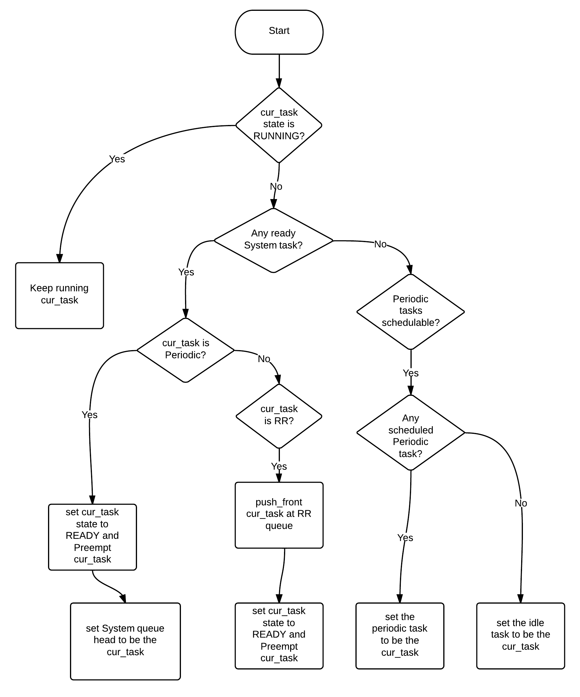

# simpleRTOS

This is a small RTOS designed for Cortex-M microcontrollers, providing features such as timers, semaphores, and mutexes, primarily for learning and experimentation. It uses a preemptive, priority-based scheduler driven by SysTick, and is designed with minimal memory footprint and straightforward configuration. 

Note: This is not intended for production use.

## Achitecture

Tasks are stored in a linked list orded by priority.
Tasks waiting for mutex, immdeatly run after the mutex is released
List of timers is also used as the queue for timer waiting to run.

### Scheduler 



## Configuration

Configure the kernel in `simpleRTOSConfig.h` header:

```c
/* RTOS sensibility is how responsive is the system*/
#define __sRTOS_SENSIBILITY_10MS 100 // above 1MS all function that use MS time as input will works multiples of __sRTOS_SENSIBILITY in this case multipules of 10MS
#define __sRTOS_SENSIBILITY_1MS 1000
#define __sRTOS_SENSIBILITY_500us 2000
#define __sRTOS_SENSIBILITY_250us 4000
#define __sRTOS_SENSIBILITY_100us 10000

#define __sRTOS_SENSIBILITY __sRTOS_SENSIBILITY_500us
/**************************************************/

// #define __sUSE_PREEMPTION 1        // unavailable
#define __sQUANTA 2                   // the quanta duration is relative to __sRTOS_SENSIBILITY
                                      // if sensibility is 100us then 1 quanta = 100us
                                      //(note:same priority tasks are rotate)
#define __sTIMER_TASK_STACK_DEPTH 256 // in words
#define __sTIMER_LIST_LENGTH 3        // Number of timers (keep the length of the list equal to the number of timer you create for best performance)
#define __sMAX_DELAY 0xFFFFFFFF
```

# simpleRTOS API Reference

## System Control

### `sRTOSInit`
Initializes the RTOS.
````c
sRTOS_StatusTypeDef sRTOSInit(sUBaseType_t BUS_FREQ);
````
- **@brief:** Initializes the RTOS.
- **@attention:** `sRTOSInit` sets up the SysTick timer to generate interrupts every `__sRTOS_SENSIBILITY` ticks, and creates an idle task that runs when no other task is ready to execute.

### `sRTOSStartScheduler`
Starts the scheduler.
````c
extern void sRTOSStartScheduler(void);
````
- **@brief:** Starts the scheduler by running the highest-priority task created and enabling the SysTick timer.

### `__sCriticalRegionBegin`
Disable IRQ Interrupts.
````c
__STATIC_FORCEINLINE__ void __sCriticalRegionBegin(void);
````
- **@brief:** Disable IRQ Interrupts.
- **@attention:** Disables IRQ interrupts by setting the I-bit in the CPSR. Can only be executed in Privileged modes.

### `__sCriticalRegionEnd`
Enable IRQ Interrupts.
````c
__STATIC_FORCEINLINE__ void __sCriticalRegionEnd(void);
````
- **@brief:** Enable IRQ Interrupts.
- **@attention:** Enables IRQ interrupts by clearing the I-bit in the CPSR. Can only be executed in Privileged modes.

## Task Management

### `sRTOSTaskCreate`
Creates a new task.
````c
sRTOS_StatusTypeDef sRTOSTaskCreate(
    sTaskFunc_t task,
    char *name,
    void *arg,
    sUBaseType_t stacksizeWords,
    sPriority_t priority,
    sTaskHandle_t *taskHandle,
    sUBaseType_t fpsMode);
````
- **@brief:** Creates a new task.
- **@attention:** Tasks can still be created after `sRTOSStartScheduler()` is called. `sRTOSTaskCreate` updates the `nextTask` field in the `taskHandle`.

### `sRTOSTaskUpdatePriority`
Updates a task's priority.
````c
void sRTOSTaskUpdatePriority(sTaskHandle_t *taskHandle, sPriority_t priority);
````
- **@brief:** Updates a task's priority.
- **@attention:** This function can be heavy if you have many tasks. When executed, the function enters a critical region.

### `sRTOSTaskStop`
Stops a task.
````c
void sRTOSTaskStop(sTaskHandle_t *taskHandle);
````
- **@brief:** Stop Task.
- **@note:** Stopping the currently running task will yield.

### `sRTOSTaskResume`
Resumes a stopped task.
````c
void sRTOSTaskResume(sTaskHandle_t *taskHandle);
````
- **@brief:** Resume Task.
- **@note:** Will yield if the currently running task has a lower priority than the resumed task.

### `sRTOSTaskDelete`
Deletes a task.
````c
void sRTOSTaskDelete(sTaskHandle_t *taskHandle);
````
- **@brief:** Delete Task.
- **@attention:** If a non-existing `taskHandle` is provided, nothing happens. 26 bytes are left from every deleted task.
- **@note:** Deleting the currently running task will yield.

### `sRTOSTaskDelay`
Delays a task for a specified duration.
````c
void sRTOSTaskDelay(sUBaseType_t duration_ms);
````
- **@note:** Only works on tasks.

### `sRTOSTaskYield`
Manually runs the scheduler to yield the CPU.
````c
__STATIC_FORCEINLINE__ void sRTOSTaskYield(void);
````
- **@note:** Runs the scheduler.

## Timer Management

### `sRTOSTimerCreate`
Creates a new timer.
````c
sRTOS_StatusTypeDef sRTOSTimerCreate(
    sTimerFunc_t timerTask,
    sUBaseType_t id,
    sBaseType_t period,
    sUBaseType_t autoReload,
    sTimerHandle_t *timerHandle);
````
- **@brief:** Creates a new timer.
- **@attention:** Timers can still be created after `sRTOSStartScheduler()` is called.

### `sRTOSTimerStop`
Stops a timer.
````c
void sRTOSTimerStop(sTimerHandle_t *timerHandle);
````
- **@brief:** Stop Timer.
- **@attention:** Will not stop the timer if it is already running its callback.

### `sRTOSTimerResume`
Resumes a stopped timer.
````c
void sRTOSTimerResume(sTimerHandle_t *timerHandle);
````
- **@brief:** Resume Timer.

### `sRTOSTimerDelete`
Deletes a timer.
````c
void sRTOSTimerDelete(sTimerHandle_t *timerHandle);
````
- **@brief:** Delete Timer.
- **@attention:** If a timer deletes itself or is deleted from an ISR, the timer continues executing until it returns. Deleting while the timer is still running causes use-after-free. Do NOT delete a timer until the timer is no longer in use (because its memory is freed).
- **@note:** If a NULL or invalid `timerHandle` is provided, no action is taken.

### `sRTOSTimerUpdatePeriode`
Updates the period of a timer.
````c
void sRTOSTimerUpdatePeriode(sTimerHandle_t *timerHandle, sBaseType_t period);
````
- **@brief:** Update Timer Periode.

## Semaphore Management

### `sRTOSSemaphoreCreate`
Creates a semaphore.
````c
void sRTOSSemaphoreCreate(sSemaphore_t *sem, sBaseType_t n);
````
- **@brief:** Create Semaphore.

### `sRTOSSemaphoreGive`
Gives a semaphore.
````c
void sRTOSSemaphoreGive(sSemaphore_t *sem);
````
- **@brief:** Gives a semaphore.
- **@attention:** This call will not yield.

### `sRTOSSemaphoreTake`
Takes a semaphore (non-cooperative).
````c
sbool_t sRTOSSemaphoreTake(sSemaphore_t *sem, sUBaseType_t timeoutTicks);
````
- **@brief:** Takes a semaphore.
- **@attention:** This call will not yield while waiting.

### `sRTOSSemaphoreCooperativeTake`
Takes a semaphore (cooperative).
````c
sbool_t sRTOSSemaphoreCooperativeTake(sSemaphore_t *sem, sUBaseType_t timeoutTicks);
````
- **@brief:** Takes a semaphore.
- **@attention:** This call will yield while waiting. (Use when the timeout is longer than one time quantum.)

## Mutex Management

### `sRTOSMutexCreate`
Creates a mutex.
````c
void sRTOSMutexCreate(sMutex_t *mux);
````
- **@brief:** Create Mutex.

### `sRTOSMutexGive`
Releases a mutex.
````c
sbool_t sRTOSMutexGive(sMutex_t *mux);
````
- **@brief:** Releases a mutex (only the owning task can release it).
- **@attention:** This call will yield.

### `sRTOSMutexGiveFromISR`
Releases a mutex from an ISR.
````c
sbool_t sRTOSMutexGiveFromISR(sMutex_t *mux);
````
- **@brief:** Releases a mutex without checking ownership.
- **@attention:** This call will not yield.

### `sRTOSMutexTake`
Takes a mutex.
````c
sbool_t sRTOSMutexTake(sMutex_t *mux, sUBaseType_t timeoutTicks);
````
- **@brief:** Takes a mutex.
- **@attention:** This call will yield while waiting.
- **@note:** If a task successfully takes the mutex, it becomes the owner.

## Utilities

### `srMS_TO_TICKS`
Converts milliseconds to system ticks.
````c
__STATIC_FORCEINLINE__ sUBaseType_t srMS_TO_TICKS(sUBaseType_t timeoutMS);
````
- **@brief:** MS to ticks.


## Quick usage

```c
#include <stdint.h>
#include "stm32f4xx.h"

#include "simpleRTOS.h"

uint32_t count0, count1, count2, count3, count4;
uint32_t timercount0, timercount1, timercount2;

sTaskHandle_t Task0H;
sTaskHandle_t Task1H;
sTaskHandle_t Task2H;
sTimerHandle_t Timer0H;
sTimerHandle_t Timer1H;
sTimerHandle_t Timer2H;

void Timer0(sTimerHandle_t *h)
{
  timercount0++;
}
void Timer1(sTimerHandle_t *h)
{
  timercount1++;
}
void Timer2(sTimerHandle_t *h)
{
  timercount2++;
}

void Task0(void *)
{
  sRTOSTaskDelay(5);
  while (1)
  {
    count0++;
    if (count0 % 1000 == 0)
    {
      sRTOSTaskStop(&Task0H);
    }
  }
}

void Task1(void *)
{
  while (1)
  {
    count1++;
    if (count1 = 1000 == 0)
    {
      sRTOSTaskStop(&Task0H);
    }
  }
}

void Task2(void *)
{
  while (1)
  {
    count2++;
    if (count2 = 9000 == 0)
    {
      sRTOSTaskDelete(&Task0H);
    }
  }
}

int main(void)
{
  SystemCoreClockUpdate();
  sRTOSInit(SystemCoreClock);

  sRTOSTaskCreate(Task0,
                  "Task0",
                  NULL,
                  128,
                  sPriorityHigh,
                  &Task0H,
                  srFALSE);

  sRTOSTaskCreate(Task1,
                  "Task1",
                  NULL,
                  128,
                  sPriorityNormal,
                  &Task1H,
                  srTRUE);

  sRTOSTaskCreate(Task2,
                  "Task2",
                  NULL,
                  128,
                  sPriorityNormal,
                  &Task2H,
                  srTRUE);

  sRTOSTimerCreate(
      Timer0,
      1,
      2,
      srTrue,
      &Timer0H);

  sRTOSTimerCreate(
      Timer1,
      1,
      4,
      srTrue,
      &Timer1H);
  sRTOSTimerCreate(
      Timer2,
      1,
      5,
      srFalse,
      &Timer2H);

  sRTOSStartScheduler();
}
```
